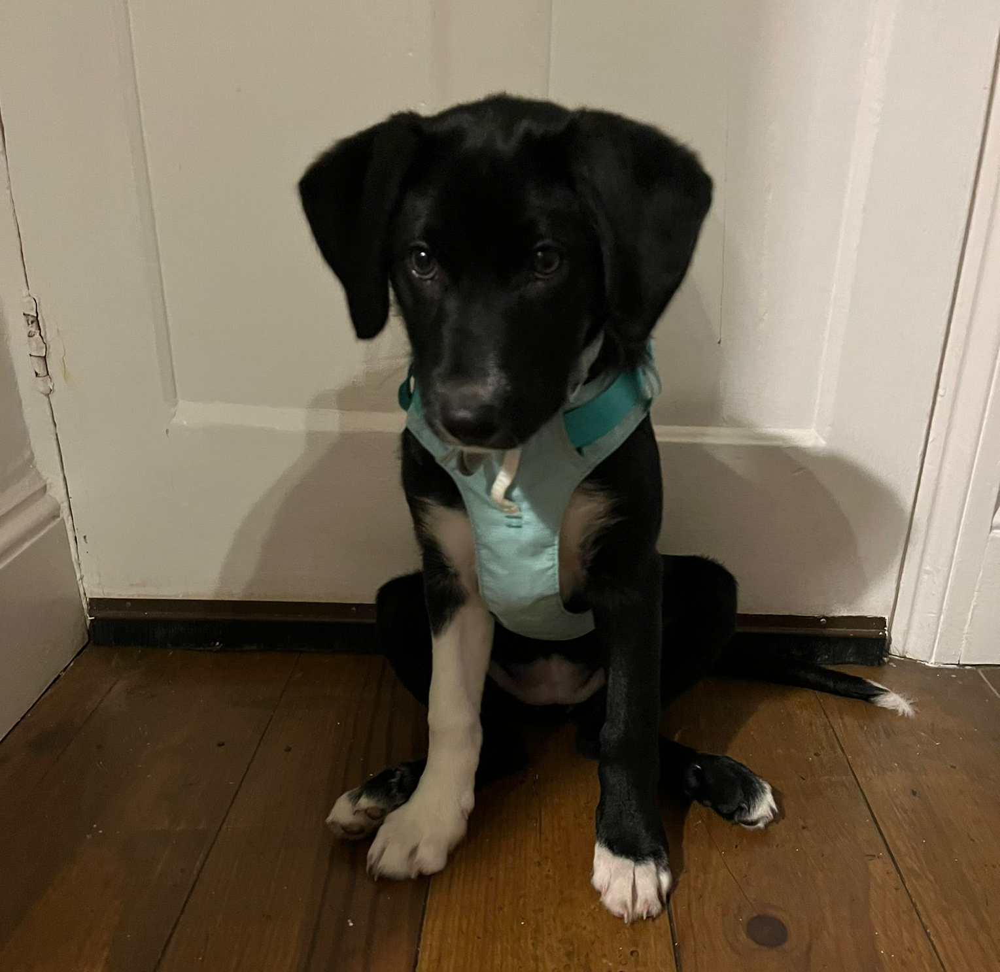

```{r setup, include=FALSE}
knitr::opts_chunk$set(echo = FALSE)
```

*Note this was written at 2am whilst sitting up with Poppy the puppy who was dealing with the trauma of her first outside the house walk.*



>Warning: One five year-old described this paper as double extra boring - these comments have been noted and we are working on it (we still think it is both interesting and important though).

## Where can I read it?

You can read the paper [here](https://www.medrxiv.org/content/10.1101/2024.01.12.24301247v1). If interested in the code repository you can check it out [here](https://github.com/parksw3/epidist-paper). The in-progress package that generalises the paper code is available [here](https://github.com/epinowcast/epidist) (contributions welcome!).

## What motivated this work?

My involvement in this work grew out of my general confusion about how to best estimate delay distributions during outbreaks, and in particular, how the various methods that are used in practice compare and interact. I have been grappling with this [problem](https://package.epinowcast.org) for a while, but never to my complete satisfaction. This all came to a head when I was asked to help write an [editorial](https://www.bmj.com/content/379/bmj.o2504) for [Ward et al. 2022](https://www.bmj.com/content/379/bmj-2022-073153), and I realized I needed some help.

As is often the case when deep thinking is required, I reached out to Sang Woo Park for assistance. This began a rather long conversation where my main contribution was repeatedly admitting, "I don't understand." After a while, we arrived at this [gist](https://gist.github.com/seabbs/027cd1c439e8acf1d598cc03ef33aaa4), which finally made things click for me.

In the course of this back-and-forth, we read a lot of the related literature and realized that there was generally a lot of confusion about how to estimate delay distributions and how to compare methods. We also recognized that there was significant confusion about the various biases that can be introduced and how they interact. Obviously, this was a substantial topic, so we needed the help of some very tolerant and talented co-authors to make a dent in it. Time to light the beacons and call for help!

This collaboration led to a very enjoyable and productive period of tackling some of the challenges in estimating delay distributions. I am deeply grateful to all the co-authors for their patience and hard work, especially given the long gestation period of this paper due to its complexity and it being largely a side project for all involved. I'm also looking forward to continuing to work on this topic and hopefully making progress on the many open questions that remain.

## What is the paper about?

### Background

- **Importance of accurate distribution estimates:** Key for epidemic modeling and decision-making.
- **Right truncation:** Overlooking this leads to underestimated delay during real-time analysis.
- **Interval censoring:** When both events that make up a delay are only known down to an interval, double censoring needs attention.
- **Dynamical bias:** Similar to demographic changes, affecting observed delay distributions.
- **Existing methods:** Methods exist but lack systematic comparison or full bias adjustment.

### What exactly did we do?

- **Theory overview:** Clarifies the theory behind estimating distributions.
- **Review of methods:** Examines various methods in light of the theory we have discussed.
- **Method evaluation:** Utilizes simulations and data from the Ebola epidemic for method comparison and evaluation.
- **Guidance for practice:** Offers cautionary and practical guidance for estimating delays, including future research directions. (*Kelly Charniga is leading on a follow-up piece that will be more focused on this as well as offering advice on best practice more generally.*).

### Key Findings

- **Impact of neglecting biases:** Ignoring biases leads to flawed epidemiological estimates in nearly all scenarios.
- **Dynamical bias and right truncation:** In a growing epidemic, these biases are nearly equivalent for delays with independent events and can be adjusted for using the same methods (*TLDR: Don't adjust for both in these settings *).
- **Common censoring adjustment issues:** Naive discretization can cause biased estimates. Many ad-hoc methods exist and often perform poorly.
- **Method performance:** Highlights the best performing methods (generally treating primary and secondary events as latent variables and estimating a continuous distribution normalised by the probability of observing the secondary event worked well. See the paper - its simpler than it sounds!) and their limitations.
- **Residual biases:** Persist across all methods, especially due to uniform interval distribution assumptions when the delay was short compared to the censoring interval. *This is an area of further work!*

Read the [paper](https://www.medrxiv.org/content/10.1101/2024.01.12.24301247v1) for more details (there is a summary at the beginning and in every section to get you going - we know it is long)!

## Poppy the puppy

If I entrapped you with cute puppy pictures then I apologise. Here is another picture of Poppy the puppy to make up for it. She is a 13 week old Lab/Border Collie mix from near Stonehenge. She is very smart, cute, and a serial killer (so we get on well).

